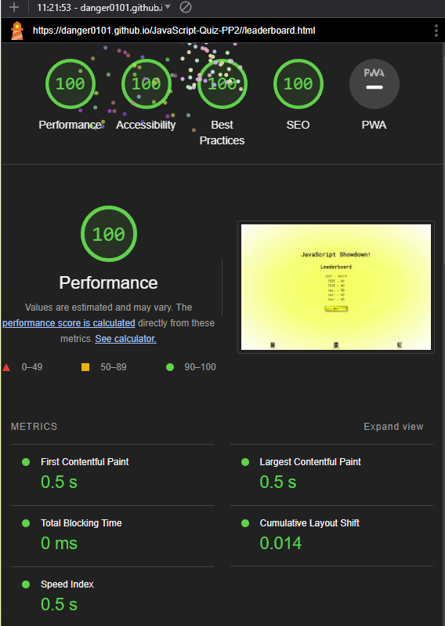
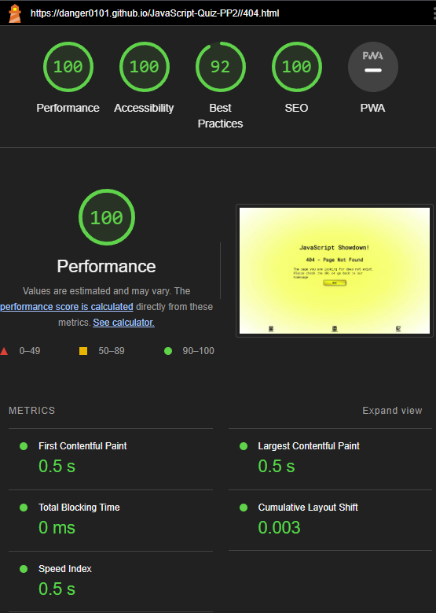

# JavaScript-Quiz-PP2

JavaScript quiz made to showcase skills using JavaScript, HTML, and CSS. The purpose is to allow users to test their knowlesge of JavaScript.
---
## User Stories
- As a user, I want to be able to start the quiz and see the first question.
- As a user, I want to see a progress indicator showing the current question number out of the total questions.
- As a user, I want to see a score indicator showing my current score during the quiz.
- As a user, I want to see multiple choice options for each question.
- As a user, I want to select an answer and see if it's correct or incorrect.
- As a user, I want to see my score updated if my answer is correct.
- As a user, I want to move to the next question automatically after answering a question.
- As a user, I want to see the quiz end after answering all questions or reaching a maximum number of questions.
- As a user, I want to see my final score at the end of the quiz.
- As a user, I want to have the option to restart the quiz after finishing it.
- As a user, I want to see a leaderboard with the top scores.
- As a user, I want to be able to submit my score and username to the leaderboard.
- As a user, I want to see my position on the leaderboard after submitting my score.
- As a user, I want to see a message if my score is not high enough to make it to the leaderboard.
- As a user, I want to be able to go back to the main menu from the leaderboard.

## Features
### Index

Landing page of JavaScript Showdown. It displays a play button when pressed that starts the quiz. Also visible is a leaderboard button which will take you to the leaderboard page.
---
### Quiz

This page starts with a loading animation which will be hidden when the quiz has fully loaded. From here a user will select an answer and it will highlight red if it is wrong or green if its correct and after 1 second it will load the next question. There is a HUD that will diplay the score and current question with a progress bar. After the final question it will take you to the end page.
---
### End

Page will load and show your score where you will be able to save your score to the leaderboard. There is a input field for the username and a submit button to save the score.
---
### Leaderboard

This will show the leaderboard data upon load.
---
## Testing
### How I tested
| What test was completed | Passed? Y(yes)/N(no) |
|:-----------------------:|:-------------------:|
| Responiveness on Samsung A41 Phone | Y |
| Responsiveness on Tablet | Y |
| Responsiveness om desktop Google chrome 1920px x 1080px | Y |
| Responsiveness om desktop Google chrome 5120px x 1440px| Y |
| Responsiveness om desktop Google chrome 2560px by 1440px | Y |
| Google chrome lighthouse | Y |
| Contrast checker | Y |
| CSS Validation | Y |
| JavaScript Validation script.js | Y |
| JavaScript Validation end.js | Y |
| JavaScript Validation highscores.js | Y |
| HTML Validation | N |
|  |  |
|  |  |
|  |  |
|  |  |
|  |  |
|  |  |
|  |  |
|  |  |
- Google Chrome (various resolutions)
- Samsung A41 Phone (image is slightly outdated new paragrap texts)

- Teclast Tablet (image is slightly outdated new paragrap texts)

### bugs encountered

| Bugs/Issues Encountered          | How problem was fixed                               | Fixed Y(yes)/N(no) |
|:--------------------------------:|:---------------------------------------------------:|:------------------:|
| Play button was not loading quiz | was a missing bracket that was deleted accidentally | Y                  |
| Questions Were Not Displaying    | Was a typo in json file name in script.js           | Y                  |
| Issue placeholder                |                                                     |                    |
| Issue placeholder                |                                                     |                    |
| Issue placeholder                |                                                     |                    |
| Issue placeholder                |                                                     |                    |
| Issue placeholder                |                                                     |                    |

---

## Validation testing
### CSS
-checked with [W3 CSS Validator](https://jigsaw.w3.org/css-validator/) Any CSS issues?

### HTML
- checked with [W3 HTML Validator](https://validator.w3.org/) were there any warnings or errors?

**Index.html**

**Quiz.html**

**End.html**

**Leaderboard.html**

**404.html**

### Contrast
- Checked all pages with [A11Y contrast checker](https://color.a11y.com/) Any contrast issues?

### JavaScript

### Index.html
**Chrome lighthouse desktop**

**Chrome mobile lighthouse**

### Quiz.html
**Chrome lighthouse Desktop**

**Chrome lighthouse mobile**

### End.html
**Chrome lighthouse Desktop**

**Chrome lighthouse mobile**

### Leaderboard.html
**Chrome lighthouse Desktop**

**Chrome lighthouse mobile**

### 404.html
**Chrome lighthouse Desktop**

**Chrome lighthouse mobile**

## Deployment
Used github pages [View Site here]()

## Technology used
- HTML
- CSS
- JavaScript
- Json
- Fontawesome
- Google Fonts
- Visual Studios Code (VSCode)
- Github
- Hypervisor
- Git
- Gyzo
- MS Paint
- Gimp version 2.10.22
- Github Desktop App

## Wireframes
### Index.html

### Quiz.html

### End.html

### Leaderboard.html

## Credits
**Code related**
- [dcode](https://www.youtube.com/watch?v=mntgaH5x-GQ&t=95s) for how to add a colored navigation bar.

- W3Schools for inspiration on the loading CSS for use on quiz page.

- My wife who’s been supper supportive of this change in career for me and just being out right amazing we will get her into this one way or another I am sure.

- Code Institute for providing an excellent accelerated learning platform worth every penny.
---
## Future feature ideas
| **Features to add** | **Added Y(yes)/N(no)** |
|:-------------------:|:--------------------:|
| Pages for menu, leaderboard, quiz, and an end page | Y |
| Fifteen Quiz questions to start | Y |
| HUD to show score and question progress | Y |
| Leaderboard which uses local storage (svae/load) | Y |
| Loader to display whil quiz loads up | Y |
| Add more questions | N |
| Add a difficulty picker | N |
| Added a database for scores | N |
| Backend database for score keeping | N |
| Seperate leaderboards based on difficulty | N |
| How to play button that opens a div on how to play the quiz | N |
| Footer with links to author | N |