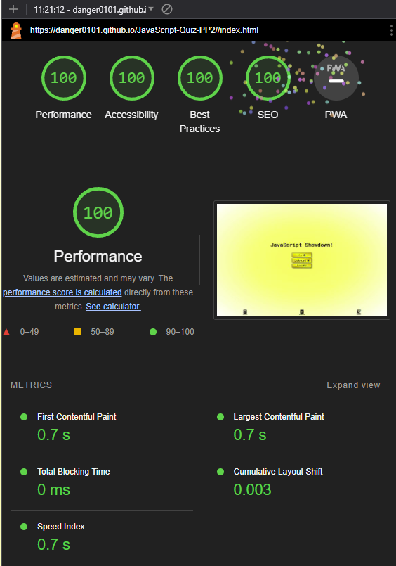
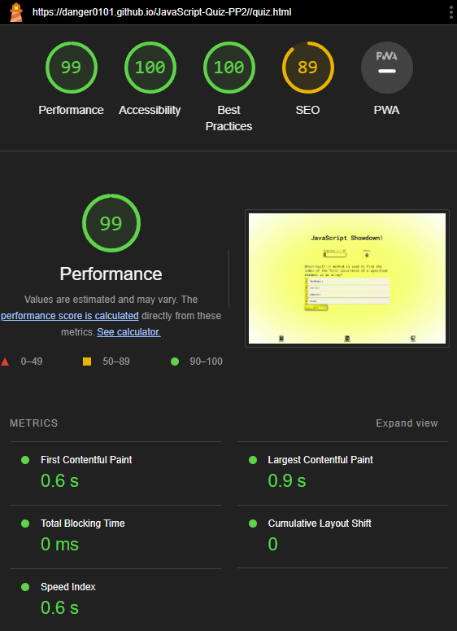
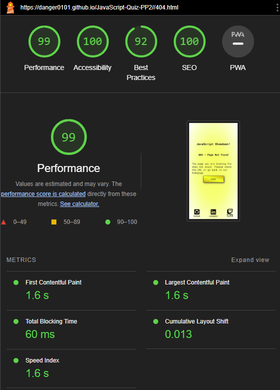

# JavaScript-Quiz-PP2

JavaScript quiz made to showcase skills using JavaScript, HTML, and CSS. The purpose is to allow users to test their knowlesge of JavaScript. It uses 4 pages to accomplish the end goal of a functioning JavaScript quiz. With three seperate scripts. The main reason for this multy page set up rather then 1 page is cleaner code as it keeps scripts a bit cleaner and they only need to contain whats needed for each page. While a single page can be faster in some cases I feel this layout suited my intentions better. As the inital load of the page is faster then if everything was all jumbled together also means quiz resets each go around or if user refreshes the page. This site is intended to be used in a traditional desktop, laptop browser window, or a mobile device in portrait mode. Landscape is known to cause issues.

---
## User Stories
- As a user, I want to be able to start the quiz and see the first question.
- As a user, I want to see a progress indicator showing the current question number out of the total questions.
- As a user, I want to see a score indicator showing my current score during the quiz.
- As a user, I want to see multiple choice options for each question.
- As a user, I want to select an answer and see if it's correct or incorrect.
- As a user, I want to see my score updated if my answer is correct.
- As a user, I want to move to the next question automatically after answering a question.
- As a user, I want to see the quiz end after answering all questions or reaching a maximum number of questions.
- As a user, I want to see my final score at the end of the quiz.
- As a user, I want to have the option to restart the quiz after finishing it.
- As a user, I want to see a leaderboard with the top scores.
- As a user, I want to be able to submit my score and username to the leaderboard.
- As a user, I want to see my position on the leaderboard after submitting my score.
- As a user, I want to see a message if my score is not high enough to make it to the leaderboard.
- As a user, I want to be able to go back to the main menu from the leaderboard.

## Features
### Index

Landing page of JavaScript Showdown. It displays a play button when pressed that starts the quiz. Also visible is a leaderboard button which will take you to the leaderboard page.
---
### Quiz

This page starts with a loading animation which will be hidden when the quiz has fully loaded. From here a user will select an answer and it will highlight red if it is wrong or green if its correct and after 1 second it will load the next question. There is a HUD that will diplay the score and current question with a progress bar. After the final question it will take you to the end page.
---
### End

Page will load and show your score where you will be able to save your score to the leaderboard. There is a input field for the username and a submit button to save the score.
---
### Leaderboard

This will show the leaderboard data upon load.
---
## Testing
### How I tested
| What test was completed | Passed? Y(yes)/N(no) |
|:-----------------------:|:-------------------:|
| Responiveness on Samsung A41 Phone Portrait | Y |
| Responiveness on Samsung A41 Phone Landscape | N |
| Responsiveness on Tablet Portrait | Y |
| Responsiveness on Tablet Landscape | N |
| Responsiveness om desktop Google chrome 1920px x 1080px | Y |
| Responsiveness om desktop Google chrome 5120px x 1440px| Y |
| Responsiveness om desktop Google chrome 2560px by 1440px | Y |
| Google chrome lighthouse | Y |
| Contrast checker | Y |
| CSS Validation | Y |
| JavaScript Validation script.js | Y |
| JavaScript Validation end.js | Y |
| JavaScript Validation highscores.js | Y |
| HTML Validation | Y |
| Chrome inspect element large number of phone oprtions (landscape rotation) | N |
|  |  |

- Samsung A41 Phone (image is slightly outdated new paragrap texts)

- Teclast Tablet (image is slightly outdated new paragrap texts)

### bugs encountered

| Bugs/Issues Encountered          | How problem was fixed                               | Fixed Y(yes)/N(no) |
|:--------------------------------:|:---------------------------------------------------:|:------------------:|
| Play button was not loading quiz | was a missing bracket that was deleted accidentally | Y |
| Questions Were Not Displaying | Was a typo in json file name in script.js | Y |
| Mobile device landscape not displaying as intended. Author links and title appear in odd fashion on certian resolutions | Ongoing issue tried diffrent css | N |
| Author Links appearing underneath other elements at certain resolutions | Removed Z index | Y |
| How to div was displaying upon load | Added hidden class to it to hide it on load | Y |
| Responsive css attempt of landscape mode set everything in an od skew to left | Removed the css that caused issue | Y |

---

## Validation testing
### CSS
-checked with [W3 CSS Validator](https://jigsaw.w3.org/css-validator/) Any CSS issues?

### HTML
- checked with [W3 HTML Validator](https://validator.w3.org/) were there any warnings or errors?

**Index.html**

**Quiz.html**

**End.html**

**Leaderboard.html**

**404.html**

### Contrast
- Checked all pages with [A11Y contrast checker](https://color.a11y.com/) Any contrast issues?

### JavaScript

### Index.html
**Chrome lighthouse desktop**

**Chrome mobile lighthouse**

### Quiz.html
**Chrome lighthouse Desktop**

**Chrome lighthouse mobile**

### End.html
**Chrome lighthouse Desktop**

**Chrome lighthouse mobile**

### Leaderboard.html
**Chrome lighthouse Desktop**

**Chrome lighthouse mobile**

### 404.html
**Chrome lighthouse Desktop**

**Chrome lighthouse mobile**

## Deployment
Used github pages [View Site here](https://danger0101.github.io/JavaScript-Quiz-PP2/index.html)

## Technology used
- HTML
- CSS
- JavaScript
- Json
- Fontawesome
- Google Fonts
- Visual Studios Code (VSCode)
- Github
- Hypervisor
- Git
- Gyzo
- MS Paint
- Gimp version 2.10.22
- Github Desktop App

## Wireframes
### Index.html

### Quiz.html

### End.html

### Leaderboard.html

### 404.html

## Credits
**Code related**
- [My project one](https://github.com/Danger0101/Meaningful_Careers_P1) for structure of this reademe file

- My previous assessor for ideas on the readme file. Sorry do to the nature of assessing I have no idea who you are but thank you for the invaluable advice.

- W3Schools for inspiration on the loading CSS for use on quiz page.

- My wife who’s been supper supportive of this change in career for me and just being out right amazing we will get her into this one way or another I am sure.

- Code Institute for providing an excellent accelerated learning platform worth every penny.
---
## Future feature ideas
| **Features to add** | **Added Y(yes)/N(no)** |
|:-------------------:|:--------------------:|
| Pages for menu, leaderboard, quiz, and an end page | Y |
| Fifteen Quiz questions to start | Y |
| HUD to show score and question progress | Y |
| Leaderboard which uses local storage (svae/load) | Y |
| Loader to display whil quiz loads up | Y |
| Footer with links to author | Y |
| Add more questions | N |
| Add a difficulty picker | N |
| Backend database for score keeping | N |
| Seperate leaderboards based on difficulty | N |
| How to play button that opens a div on how to play the quiz | N |